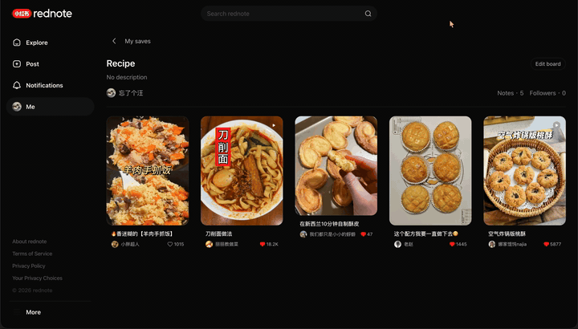
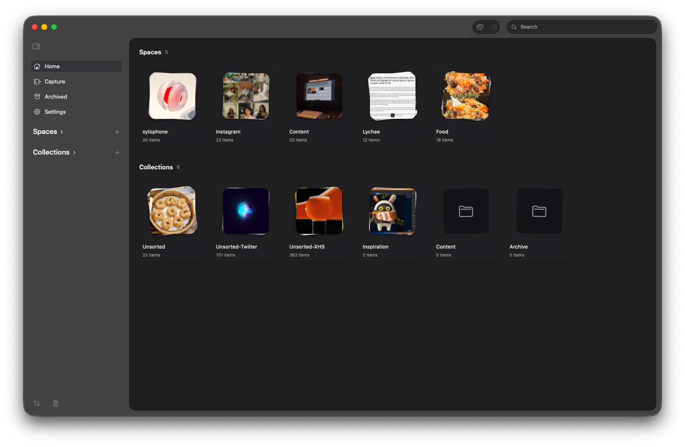
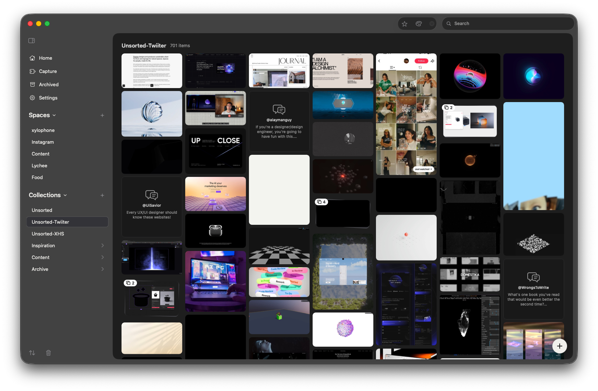
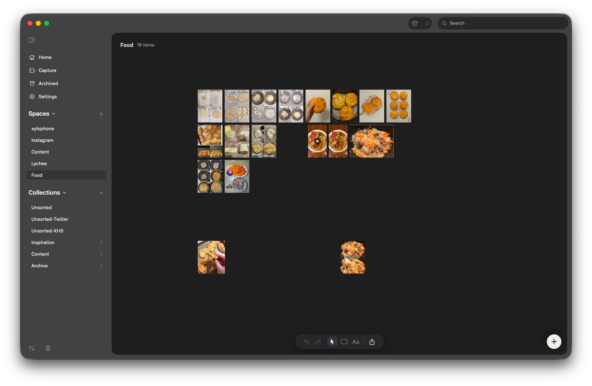
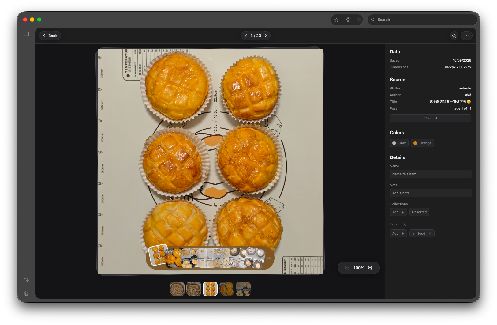

# ref-atelier

A native macOS app for curating a personal library of design references. It
ingests images and video from around the web — a Chrome extension, the iOS share
sheet, paste, drag-and-drop — organizes them into collections, and lets you
browse them as a dense grid or arrange them on an infinite canvas.



Two principles drive every decision:

1. **Local-first and fast.** Assets are downloaded and stored on-device, and
   rendered natively. The network is for *ingestion*, not *browsing*.
2. **Provenance is sacred.** Every asset records where it came from — platform,
   original URL, author, capture time. It is never stripped.

Long-form design docs live in `.docs/`; start with
[`001-foundation-overview.md`](.docs/001-foundation-overview.md).

## What it looks like

| | |
| --- | --- |
|  |  |
| **Home** — every space and collection, each with its cover and a live item count. | **A collection** — a dense justified grid. The badge on a thumbnail is a multi-image post kept together as one item. |
|  |  |
| **A space** — the infinite canvas. The same assets, arranged by hand rather than by the grid. | **Item detail** — provenance on the right (platform, author, title, a link back), the colors the analyzer derived, and the collections and tags it belongs to. |

## Layout

The app target holds SwiftUI and little else. Everything testable lives in a
local Swift package, so the compiler enforces the boundaries.

| Package | What it owns |
| --- | --- |
| `AtelierCore` | The metadata store. GRDB/SQLite is a dependency of *this* package only. |
| `AtelierIngestion` | The capture pipeline: content-addressed blobs, thumbnails, hashing. |
| `AtelierCapture` | The inbound capture contract — one wire shape, and the funnel that validates it. |
| `AtelierLibraryPaths` | Where a library lives, and what the files in it are called. |
| `AtelierServer` | The loopback HTTP endpoint the Chrome extension POSTs to. |
| `AtelierArchive` | The portable library archive — backup, export, and the phone's hand-off. |
| `AtelierBrowse` | The iOS companion's read-side logic — everything that isn't a view. |
| `AtelierExport` | Moodboard / contact-sheet layout and render. Zero product dependencies. |
| `AtelierTokens` | The design tokens, once, for every target that draws. |
| `CanvasRenderer` | The infinite canvas: transform, tile culling, LOD. |

| Target | |
| --- | --- |
| `AtelierRefs` | The macOS app. |
| `AtelierRefsMobile` | The iOS companion. |
| `AtelierRefsShare` | The iOS share extension. |
| `extension/` | The Chrome MV3 capture extension. |

## Building

Requires **Xcode 26 on macOS 26** (deployment target 26.5).

```sh
open AtelierRefs/AtelierRefs.xcodeproj   # then ⌘R
```

To build and install the Release configuration on this machine — same hardened
runtime and entitlements as a shipped build, signed with whatever identity you
have — double-click `scripts/run-local.command` in Finder, or:

```sh
./scripts/run-local.command
```

It installs into `/Applications` on purpose: that copy is the one the Dock and
Spotlight open.

## Verifying

`scripts/verify.sh` runs locally what CI runs. It parses its package list out of
`.github/workflows/ci.yml`, so the two cannot drift.

```sh
./scripts/verify.sh fast   # compile everything, test targets included. Seconds.
./scripts/verify.sh        # the full CI matrix: the ten package suites, the
                           # extension's node tests + drift check, the app's
                           # build-and-test, and a Release build.
./scripts/verify.sh ui     # the macOS UI smoke suite, alone — deliberately not
                           # part of the gate.
```

One package on its own: `cd AtelierCore && swift test`. The extension:
`cd extension && npm test`.

## The Chrome extension

"Save as you browse" — it captures the post you are looking at, fetching the
image bytes **inside your authenticated session** so auth-walled media works, and
POSTs them with their provenance to the app on loopback. The port is discovered,
not assumed: a stable app listens on **47321**, a dev build on **47322**. It also
drives bulk sweeps of a whole board or saved feed.

Load `extension/` unpacked at `chrome://extensions` for development. To build the
Web Store zip:

```sh
./scripts/package-extension.sh   # -> dist/atelier-capture-<version>.zip
```

Details, supported sites and sweep behaviour: [`extension/README.md`](extension/README.md).

## Releasing

`scripts/release.sh` is the Developer ID lane — archive → export → notarize →
staple → dmg → Sparkle appcast, with stock tools only. It needs a provisioned
machine and does not run in CI; `SECRETS.md` lists what has to be in the login
Keychain.

## Conventions

Commits are `[type]: [scope] - [message]`, 80 characters max, where type is one
of `fix`, `feat`, `refactor`, `style`, `chore`. Every change adds a numbered
entry to `.change-log/`; feature documentation goes in `.docs/` as
`xxx-<feature>-<kind>.md`. Indices are allocation order, not a sort key, and are
never reused — docs cross-reference each other by number. See
[`CLAUDE.md`](CLAUDE.md).

## Dev notes

Clear the local library. Destructive: this deletes the database, every stored
blob and every thumbnail.

```sh
rm -rf "$HOME/Library/Containers/sujenphea.AtelierRefs/Data/Library/Application Support/ref-atelier/library.sqlite"* \
       "$HOME/Library/Containers/sujenphea.AtelierRefs/Data/Library/Application Support/ref-atelier/blobs" \
       "$HOME/Library/Containers/sujenphea.AtelierRefs/Data/Library/Application Support/ref-atelier/thumbnails"
```
